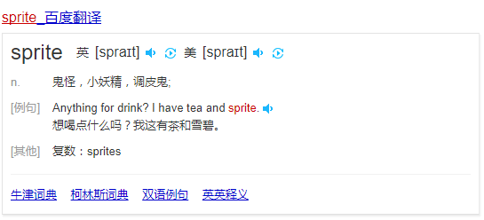

# css雪碧图

*废话不多说，先看一下雪碧图到底是什么样的*


> 1.首先先解释下为什么叫雪碧图

* ->谐音 css sprite (个人认为)
* ->直译 就是 sprite单词原本就有雪碧的意思，也有精灵的意思，所以也有人叫css精灵

 

 > 2.雪碧图到底是干什么用的
 
* 学名就是一种css图像合并技术
* 实际上就是将一些各种小的图标合并到一张图上，一般格式都为png，因为很多图标不需要背景，只要那个图标，png能做到

> 3.那到底怎么做呢，举个栗子

*一个简单的栗子：*

一个链接用CSS做成按钮的样式，我们可以使用同一张图片，完成按钮的三个状态，a:link，a:hover，a:active。

### HTML：
```
1. <a class="button" href="#">链接</a>
2. <input type="button">
3. <button type="button"></button>
```

加入下面的图片为：200px×65px的三个按钮图拼合而成的图片button.png，从上到下一次为按钮的普通、鼠标滑过、鼠标点击的状态。则可以使用CSS进行定义。


### CSS：

```
a {
    display:block; 
    width:200px; 
    height:65px; 
    line-height:65px; 
    background-image:url(button.png);
    background-position:0 0;
}
a:hover {
    background-position:0 -66px; 
}
a:active {
    background-position:0 -132px; 
}
```

*而更多的CSS雪碧，图片更复杂，背景定位更精确。可能会用到大量的数值，如：background:url("button.png") -180px 24px no-repeat; 来达到更精确的定位。*

url("")

> 4.运用这个到底有什么优点呢

* 减少加载网页图片时，对服务器的请求次数
* 提高页面的加载速度
* 假如是手机访问，可以节省用户所需使用的流量
* 减少鼠标滑过的一些bug   -*ie6不会预加载*


> 5.除了优点，肯定也不乏缺点

1. css雪碧的最大问题是内存使用
2. 影响浏览器的缩放功能
3. 拼图维护比较麻烦
4. 利用雪碧图调用的图片不能被打印

> 6.使用的一些小技巧

1. 定位时尽量避免使用bottom或right


