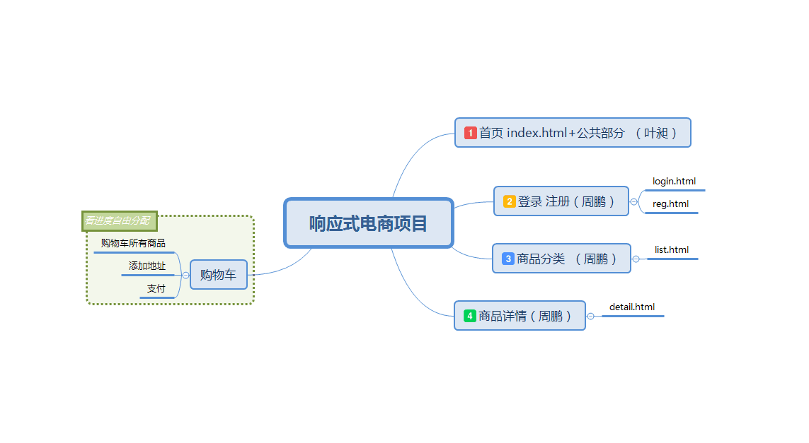

# 项目开发第一天

## 1.任务分配以及开发前准备

> 任务分配

1. 首先由Yc将项目的公共部分（首页index.html的头部以及尾部等）进行编写，同时进行登录，注册的主体部分编写
2. 接着Yc编写首页主体部分同时，Zp进行共同部分和主体的整合，进展较快，继续编写list.html和detail.html
3. 看进展进行购物车任务分配

> 开发前准备

github协同合作

# 项目测试 bug检测及调试

