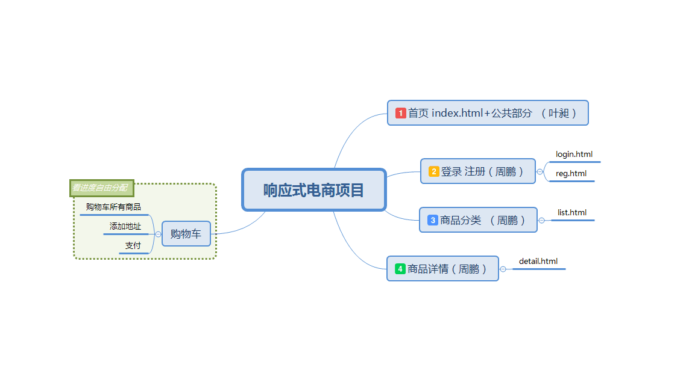

<!-- TOC -->

- [1. 项目开发第一天](#1-项目开发第一天)
    - [1.1. 任务分配以及开发前准备](#11-任务分配以及开发前准备)
- [2. 项目测试 bug检测及调试](#2-项目测试-bug检测及调试)
- [3. 项目总结](#3-项目总结)

<!-- /TOC -->
# 1. 项目开发第一天

## 1.1. 任务分配以及开发前准备

> 任务分配

1. 首先由Yc将项目的公共部分（首页index.html的头部以及尾部等）进行编写，同时进行登录，注册的主体部分编写
2. 接着Yc编写首页主体部分同时，Zp进行共同部分和主体的整合，进展较快，继续编写list.html和detail.html
3. 看进展进行购物车任务分配

> 开发前准备

github协同合作

# 2. 项目测试 bug检测及调试

# 3. 项目总结

一个礼拜的YcZp电商网站终于告一段落

由于是基于良仓项目，bootstrap，以及网站模板进行开发，再由两人协同共同开发，相对速度较快一点。

