<!-- TOC -->

- [简介](#简介)
- [需要的工具](#需要的工具)
- [用到的模块介绍](#用到的模块介绍)
- [主要操作流程](#主要操作流程)
- [基础代码如下](#基础代码如下)
    - [**modules/ 模块文件主要就是导出各种模板供启动文件server.js调用**](#modules-模块文件主要就是导出各种模板供启动文件serverjs调用)
    - [user.js  user模块](#userjs--user模块)
    - [category.js](#categoryjs)
    - [blog.js blog模块](#blogjs-blog模块)
    - [**config.js 内容为各种配置**](#configjs-内容为各种配置)
    - [server.js （这是最基本的启动文件）](#serverjs-这是最基本的启动文件)
- [开始接口编写](#开始接口编写)
    - [第一个接口 创建管理员](#第一个接口-创建管理员)
    - [第二个接口 管理员登录](#第二个接口-管理员登录)
    - [第三个接口 博客分类的增删查改](#第三个接口-博客分类的增删查改)
    - [第四个接口，博客的编写](#第四个接口博客的编写)
- [创建文件夹](#创建文件夹)

<!-- /TOC -->

## 简介
搭建一个restful风格的个人博客api
**restful风格：就是使用同一个接口，通过不同的请求方式例如post，get，put，delete等实现数据的增删查改等**

## 需要的工具
* node
* Postman或者其他接口测试工具

## 用到的模块介绍
* [express](http://www.expressjs.com.cn/) : nodejs框架  
* [mongoose](http://www.nodeclass.com/api/mongoose.html) : 用来方便的和mongodb交互
* body-parser : 方便我们从post请求中解析参数
* morgan : 把请求信息打印在控制台
* jsonwebtoken : 用来生成和确认token数据

## 主要操作流程
1. 新建一个项目文件夹，使用npm初始化
npm init -y
2. 手动输入依赖环境，或者npm install直接安装
* cnpm install --save express mongoose body-parser morgan jsonwebtoken
* cnpm install
3. 新建所需要的文件夹以及文件，目录结构如下
```
-app/
-----models/                //模块
----------blog.js
----------category.js
----------user.js
-----routes/                //路由
----------blog.js
----------category.js
----------comment.js
----------setup.js
----------user.js
-node_modules/              //依赖环境安装后生成
-config.js                  //一些配置
-package.json               //项目依赖环境(初始化后自动生成)
-server.js                  //项目启动文件
```

## 基础代码如下

### **modules/ 模块文件主要就是导出各种模板供启动文件server.js调用**

### user.js  user模块

```
var mongoose = require('mongoose'); //引入mongoose依赖
var Schema = mongoose.Schema;//mongoose的一切都是以Schema开始的

// 使用modules.exports导出User模块
module.exports = mongoose.model('User',new Schema({//利用模板的方式启动模板，并导出
    name:String,
    password:String,
    admin:Boolean
}))
```

### category.js
```
var mongoose = require('mongoose');
var Schema = mongoose.Schema;

module.exports = mongoose.model('Category',new Schema({
    title:String
}))
```

### blog.js blog模块
```
var mongoose = require('mongoose');
var Schema = mongoose.Schema;

module.exports = mongoose.model('Blog',new Schema({
    title: String,
    body:String,
    antuor:String,
    category:String,
    comment:[{body: String,date:Date}],
    tags:[{title:String}],
    date:{type:Date,default:Date.now},
    hidden:Boolean,
    mete:{
        vores:Number,
        favs:Number
    }
}))
```

### **config.js 内容为各种配置**
```
module.exports = {
    'secret':'zp,zp',    
    'database':'mongodb://127.0.0.1'
}
```

* secret的值可以随便取，主要是用来生成token时用的
* 数据库设置要连接数据库的信息


### server.js （这是最基本的启动文件）
```
var express = require('express');
var app = express();
var bodyParser = require('body-parser');
var morgan = require('morgan');
var mongoose = require('mongoose');

var jwt = require('jsonwebtoken');//用来创建和确认用户信息摘要
var config = require('./config'); //读取配置文件config.js信息

//一些配置
var port = process.env.PORT || 8080; // 设置启动端口
mongoose.connect(config.database); // 连接数据库
app.set('superSecret', config.secret); // 设置app 的超级密码--用来生成摘要的密码

//用body parser 来解析post和url信息中的参数
app.use(bodyParser.urlencoded({extended: false}));
app.use(bodyParser.json());

// 使用 morgan 将请求日志打印到控制台
app.use(morgan('dev'));

//路由
//基础路由
app.get('/',function(req,res){
    res.send("这里是nodejs+mongodb编写restfulAPI的笔记！");
})


// 启动服务
app.listen(port);
console.log('Magic happens at http://localhost:' + port);

```

先来测试一下，测试之前先开启mongodb，用postman进行测试
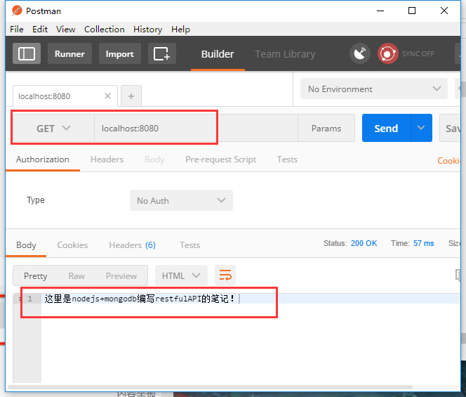


## 开始接口编写

### 第一个接口 创建管理员
>routes/setup.js
```
var express = require("express");
var User = require("../modules/user");

var router = express.Router();

router.get('/',function(req,res){

    var admin = new User({
        name:'zhoupeng1',
        password:'12345',
        admin:true
    })      //创建一个管理员

    admin.save(function(err){
        if(err){
            res.json({
                success:false,
                message:'管理员创建失败'
            });
        }
        res.json({success:true,message:"管理员创建成功"})
        
    })          //加入数据库，并判断是否成功
})

module.exports = router; //导出路由
```

然后server.js中导入路由文件
添加下面两句：
```
var setupRoute = require('./app/routes/setup');// 导入路由文件

app.use('/setup',setupRoute);   //设置访问路径
```

测试
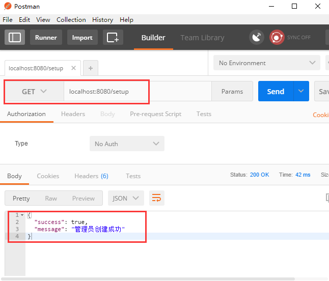

### 第二个接口 管理员登录
>routes/user.js
```
var express = require('express');
var app = express();//定义app
var User = require("../modules/user")

var jwt = require('jsonwebtoken');//用来创建和确认用户信息摘要
var config = require('../../config');
app.set('superSecret', config.secret); // 设置app 的超级密码--用来生成摘要的密码

var router = express.Router();

router.post('/login',function(req,res){
    User.findOne({
        name:req.body.name //根据用户输入用户名进行匹配
    },function(err,user){   //登录验证
        if(err){
            res.json({success:false,message:"登录失败"});
        };

        if(!user){
            res.json({success:false,message:"认证失败，用户名找不到"});
        }else if(user){
            if(user.password != req.body.password){
                res.json({success:false,message:"认证失败，密码错误"});
            }else{
                var token = jwt.sign({name:'foo'},app.get('superSecret'));//获取token
                res.json({
                    success:true,
                    message:"恭喜，登录成功",
                    token:token
                })
            }
        }
    })
})
```

然后server.js中导入路由文件
添加下面两句：
```
var userRoute = require('./app/routes/user');// 导入路由文件

app.use('/user',userRoute);   //设置访问路径
```
测试
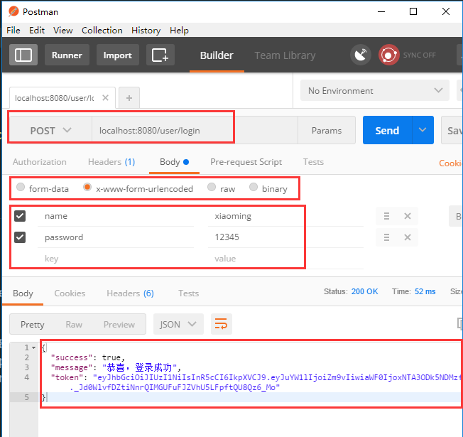

### 第三个接口 博客分类的增删查改
>routes/category.js
```
var express = require('express');
var Category = require('../modules/category')
var router = express.Router();

// 添加分类
router.post('/',function(req,res){
    var title = req.body.title;
    console.log(req);
    var category = new Category({
        title:title
    })
    category.save(function(err){
        if(err){
            res.json({
                success:false,
                message:"添加分类成功！"
            })
        }
    })
    res.json({success:true,message:"添加分类成功！"})
})

// 查看所有分类
router.get('/',function(req,res){
    Category.find({},function(err,categories){
        res.json({
            success:true,
            data:categories
        })
    })
})

// 更新分类
router.put('/',function(req,res){

    // 解构赋值
    var {title,newTitle} = req.body;
    Category.findOneAndUpdate({title:title},{title:newTitle},function(err,category){
        if(err){
            res.json({
                success:false,message:"更新分类失败"
            })
        }
    })
    res.json({success:true,message:"更新分类成功！"})
})

// 删除分类
router.delete('/',function(req,res){
    console.log('delete category');

    // 解构赋值
    var {title} = req.body;

    Category.remove({title:title},function(err){
        if(err){
            res.json({
                success:false,messge:"删除分类成功！"
            })
        }
    })
    res.json({success:true,message:"删除分类成功！"})
})

module.exports = router;
```
然后server.js中导入路由文件
添加下面两句：
```
var categoryRoute = require('./app/routes/category');// 导入路由文件

app.use('/category',categoryRoute);   //设置访问路径
```
测试添加分类，查询分类
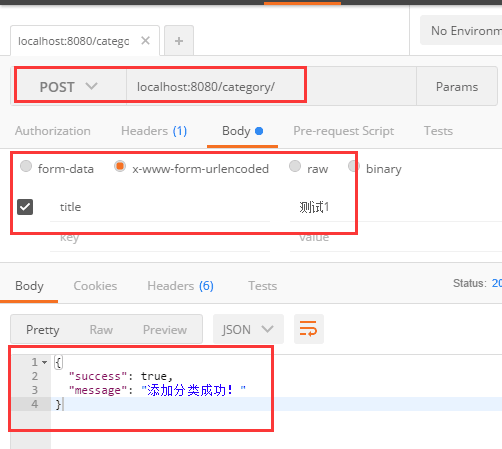
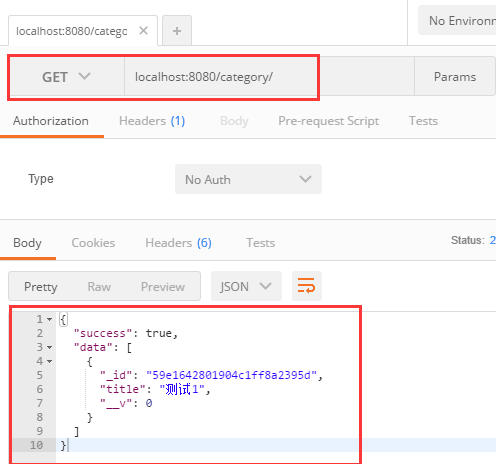

测试更新分类 首先多添加几条数据，便于查看
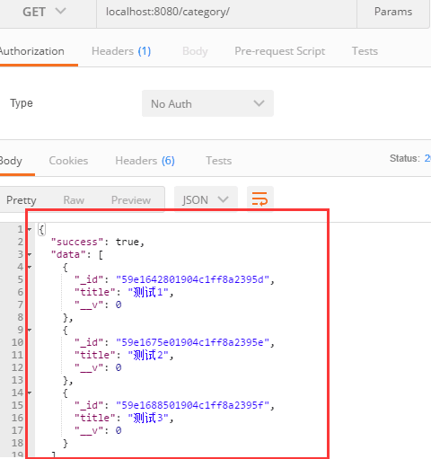
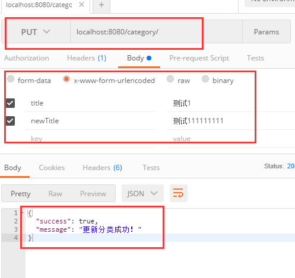
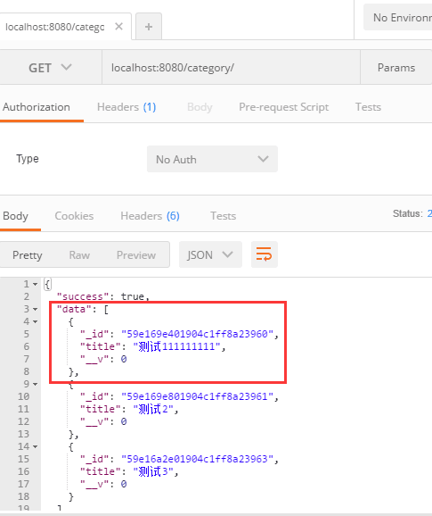

测试删除分类
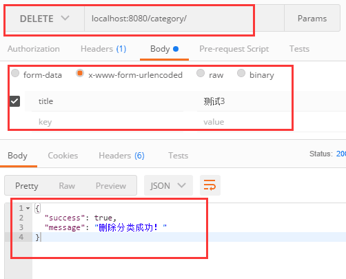
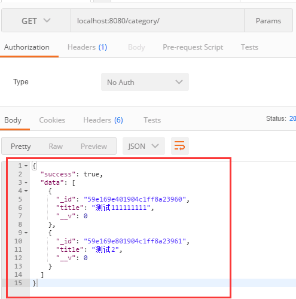

### 第四个接口，博客的编写
>routes/blog.js
```
var express = require("express");
var Blog = require("../modules/blog");

var router = express.Router();


// 显示所有博客
router.get('/',function(req,res){
    // 根据分类查找
    var {category} = req.query;
    var whereObj = {};
    if(category){
        var reg = new RegExp('^'+category+'$');
        whereObj = {category:reg}
    }
    //var reg = new RegExp('^'+category+'$')与/^category$/的区别
    //前者中的category是拼接上的一个变量，是动态的，
    //后者是静态的只能匹配'category'这个内容

    Blog.find(whereObj,function(err,blogs){
        res.json({
            success:true,
            data:blogs
        })
    })
})

// 发布博客
router.post('/',function(req,res){
    // 结构赋值
    var {title,body,author,tags,hidden,category} = req.body;
    console.log(title);
    if(title.length<3){
        res.json({
            success:false,
            message:"标题长度不能小于3"
        })
    }

    // 标签格式应该是对象数组

    // 把标签分割成数组格式
    var tagsArray = tags.split(",");
    // 新建一个空数组，用来放对象
    var tagsObjArray = [];
    // 通过遍历的方式，把标签内容放入对象里面，通过push方式
    tagsArray.forEach(function(v){
        tagsObjArray.push({title:v});
    })

    var blog = new Blog({
        title,
        body,
        author,
        tags:tagsObjArray,
        hidden,
        category
    });

   blog.save(function(err){
       if(err){
           res.json({success:false,messafe:"博客发布失败"})
       };
       res.json({success:true,message:"博客发布成功"})
   })
})

// 修改博客
router.put('/',function(){
    var {title,newTitle,body,newBody,author,newAuthor} = req.body;
    if(newTitle.length<3){
        res.json({
            success:false,
            message:"标题长度不能小于3"
        })
    }
    blog.update({
        title:title,
        body:body,
        author:author
    },{
        title:newTitle,
        body:newBody,
        author:newAuthor
    },function(err,blog){
        if(err){
            res.json({
                success:false,
                message:"更新博客失败"
            })
        }
    });
    res.json({
        success:true,
        message:"更新博客成功"
    })

})

// 删除博客
router.delete('/',function(req,res){

    // 解构赋值
    var {title} = req.body;

    Blog.remove({
        title:title,
    },function(err){
        if(err){
            res.json({
                success:false,messge:"删除博客失败！"
            })
        }
    })
    res.json({success:true,message:"删除博客成功！"})
})

module.exports = router;
```

然后server.js中导入路由文件
添加下面两句：
```
var blogRoute = require('./app/routes/blog');// 导入路由文件

app.use('/blog',blogRoute);   //设置访问路径
```
博客发布测试
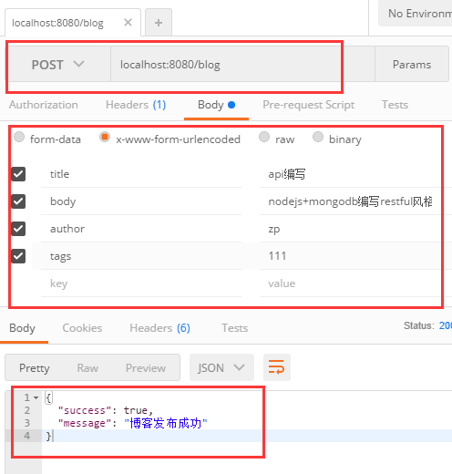
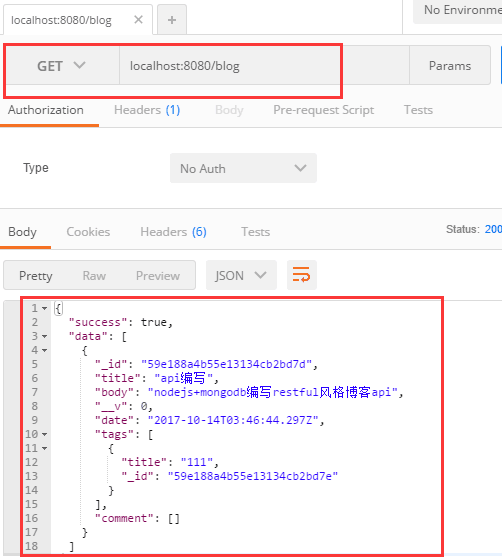

博客修改测试


## 创建文件夹
初始化 得到json文件
手动输入依赖环境，或者npm install直接安装
新建各种文件
server.js启动文件
导入。。
modulse模板
引入mongoose
利用模板的方式启动模板，并导出
routes路由
导入模板
利用mongoose的语法进行数据库数据操作
输出路由
server.js导入路由文件，
然后确定外部链接，进行访问


var reg = new RegExp('^'+category+'$')与/^category$/的区别
前者中的category是拼接上的一个变量，是动态的，
后者是静态的只能匹配'category'这个内容