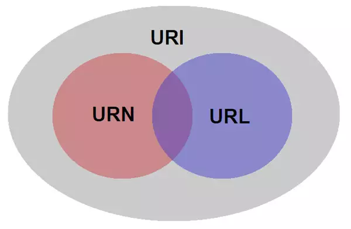

# 怎么判断一个数组

* instanceof(明确某个对象为某个特定类型)
```
var arr = [1,2,3];
console.log(arr instanceof Array);
```

* constructor(判断对象原型是否是数组)
```
console.log(arr.constructor === Array);
```

* toString()
```
var obj = {"name":"xiaoshi"};
console.log(obj);//查看对象原型，对不数组原型都有toString方法
console.log(obj.toString());
console.log(arr.toString());//原型优先用自身的方法

console.log(Object.prototype.toString.call(arr));
console.log(Object.prototype.toString.call(arr) === [object,Array]);
```

* console.log(Array.isArray(arr));


# 分享

## 一道面试题


## css3动画扩展

* 正负旋转相消
* hover取消过渡
* 水波特效


## less sass

* 混合（Mixins）：class中的class;
* 参数混合（Parametric）：可以像函数一样传递参数的class;
* 嵌套规则（Nested Rules）：class中嵌套class，从而减少重复的代码；
* 运算（Operations）：css中的数学计算；
* 颜色功能（Color function）：可以编辑你的颜色；
* 命名空间（Namespaces）：样式分组，从而方便被调用；
* 作用域（Scope）：局部修改样式；
* JavaScript表达式(Javascript evaluation)：在CSS样式中使用Javascript表达式赋值。

###  不同，差异
less在客户端处理，sass在服务器端处理
换句话说，，less基于JavaScript，sass基于Ruby

## URI URN URL的定义以及区别

### 官方解释
URI：统一资源标识符 Uniform Resource Identifier 是一个用于标识某一互联网资源名称的字符串

URN: 统一资源名称  Uniform Resource Name  唯一标识一个实体的标识符

URL: 统一资源定位符 Uniform Resource Locator 统一资源定位符是统一资源标志符的一个下种。统一资源标志符确定一个资源，而统一资源定位符不但确定一个资源，而且还表示出它在哪里。

### 三者的关系

;

### 通俗的讲呢

假如有这么一个人，这个人可以看做是URI，可以把URN看做是这个人的名字，URL则可以看做是这个人的住址
但是人名是会有重复的，这不符合官方解释，唯一标识实体的标识符，所以又可以把URN看做是身份证号

### 结合实例
URI：
http://bitpoetry.io/posts/hello.html#intro

http://
如何访问资源的方式

bitpoetry.io/posts/hello.html
资源放置的位置

#intro
就是资源

URL：
http://bitpoetry.io/posts/hello.html

URN:
bitpoetry.io/posts/hello.html#intro


